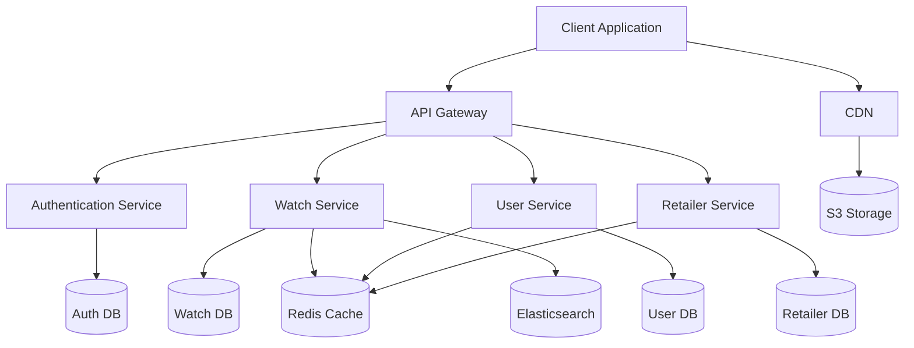
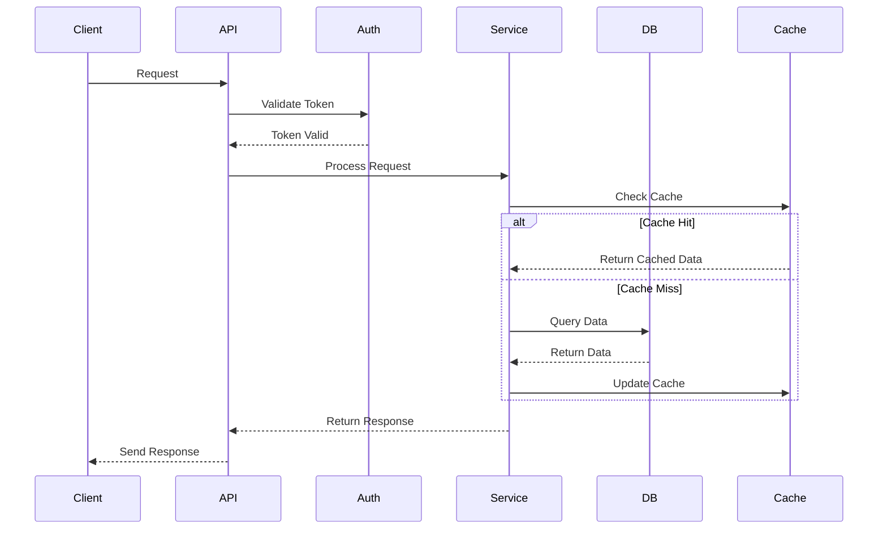
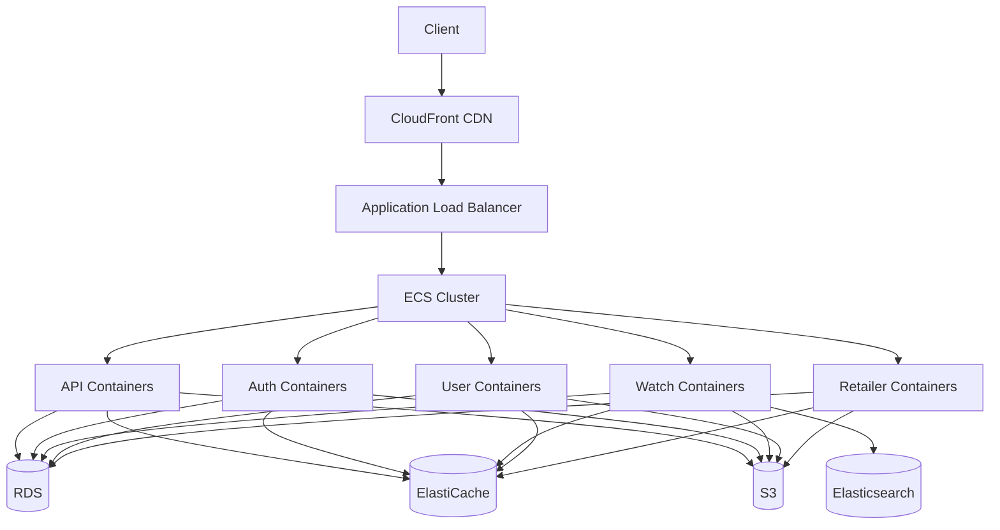

# Pocket Dial Architecture Documentation

## System Architecture



## Component Details

### 1. Client Application
- **Technology**: React with TypeScript
- **State Management**: Redux Toolkit
- **Styling**: Tailwind CSS
- **Key Features**:
  - Server-side rendering
  - Progressive Web App capabilities
  - Responsive design
  - Offline support

### 2. API Gateway
- **Technology**: Node.js/Express
- **Features**:
  - Request routing
  - Rate limiting
  - Request validation
  - Response transformation
  - Error handling

### 3. Authentication Service
- **Technology**: Node.js/Express
- **Features**:
  - JWT token management
  - OAuth integration
  - Session management
  - Password hashing
  - Role-based access control

### 4. Watch Service
- **Technology**: Node.js/Express
- **Features**:
  - Watch CRUD operations
  - Search functionality
  - Image processing
  - Price tracking
  - Inventory management

### 5. User Service
- **Technology**: Node.js/Express
- **Features**:
  - User profile management
  - Preferences handling
  - Watchlist management
  - Review system
  - Recommendation engine

### 6. Retailer Service
- **Technology**: Node.js/Express
- **Features**:
  - Retailer management
  - Inventory synchronization
  - Order processing
  - Verification system
  - Rating system

## Data Flow



## Database Schema

### Users Collection
```json
{
  "_id": "ObjectId",
  "email": "String",
  "password": "String (hashed)",
  "name": "String",
  "preferences": {
    "brands": ["String"],
    "priceRange": {
      "min": "Number",
      "max": "Number"
    },
    "movements": ["String"]
  },
  "watchlist": ["ObjectId"],
  "createdAt": "Date",
  "updatedAt": "Date"
}
```

### Watches Collection
```json
{
  "_id": "ObjectId",
  "brand": "String",
  "model": "String",
  "reference": "String",
  "price": "Number",
  "movement": "String",
  "caseSize": "Number",
  "waterResistance": "Number",
  "images": ["String"],
  "specifications": {
    "case": "String",
    "dial": "String",
    "bracelet": "String"
  },
  "reviews": [{
    "userId": "ObjectId",
    "rating": "Number",
    "comment": "String",
    "createdAt": "Date"
  }],
  "createdAt": "Date",
  "updatedAt": "Date"
}
```

### Retailers Collection
```json
{
  "_id": "ObjectId",
  "name": "String",
  "location": "String",
  "verified": "Boolean",
  "rating": "Number",
  "contact": {
    "email": "String",
    "phone": "String",
    "website": "String"
  },
  "inventory": ["ObjectId"],
  "createdAt": "Date",
  "updatedAt": "Date"
}
```

## Caching Strategy

### Redis Cache Structure
1. **Watch Cache**
   - Key: `watch:{id}`
   - TTL: 1 hour
   - Contains: Watch details, specifications, and basic review stats

2. **User Cache**
   - Key: `user:{id}`
   - TTL: 30 minutes
   - Contains: User profile and preferences

3. **Retailer Cache**
   - Key: `retailer:{id}`
   - TTL: 1 hour
   - Contains: Retailer details and basic inventory stats

## Search Implementation

### Elasticsearch Index Structure
```json
{
  "mappings": {
    "properties": {
      "brand": { "type": "keyword" },
      "model": { "type": "text" },
      "reference": { "type": "keyword" },
      "price": { "type": "float" },
      "movement": { "type": "keyword" },
      "caseSize": { "type": "float" },
      "waterResistance": { "type": "integer" },
      "specifications": {
        "properties": {
          "case": { "type": "keyword" },
          "dial": { "type": "keyword" },
          "bracelet": { "type": "keyword" }
        }
      }
    }
  }
}
```

## Security Measures

1. **API Security**
   - HTTPS/TLS encryption
   - Rate limiting
   - Request validation
   - CORS configuration
   - Security headers

2. **Authentication**
   - JWT token-based authentication
   - Password hashing with bcrypt
   - Token refresh mechanism
   - Session management

3. **Data Protection**
   - Input sanitization
   - XSS prevention
   - CSRF protection
   - SQL injection prevention
   - Data encryption at rest

## Monitoring and Logging

1. **Application Monitoring**
   - Error tracking
   - Performance metrics
   - User analytics
   - Server health checks

2. **Logging Strategy**
   - Request logging
   - Error logging
   - Audit logging
   - Performance logging

## Deployment Architecture

